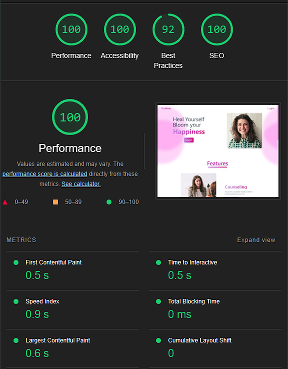
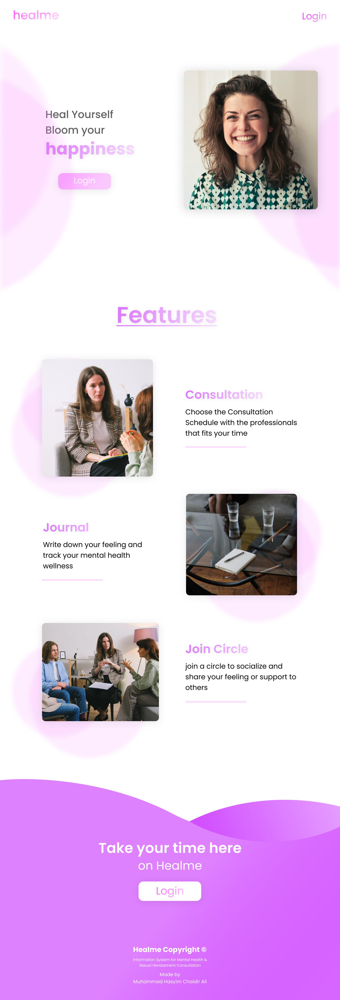

# :fallen_leaf: Healme
### College Final Project :deciduous_tree:   Made by : M Hasyim Chaidir A :man_student:

Healme is a Web App that focus on Management of Consultation Schedule with Counselor. The other features are like Journaling and Circle Community for user. this App is Open for Public especially for Malang city residents.

### Tech Stack :trumpet:
- React - Next Js ( Img Processing, Img Lazyload, Preload, SSG )
- Typescript
- Redux Toolkit
- Tailwind
- Firebase Auth & Firestore
- Simple Clean Architecture

## :anchor: Landing Page Lighthouse Score

 

## :camera: Desktop Screenshot
## :star: Landing Page

 

## :star: Login Page

 

## :star: Consultation List Page

 

## :star: Consultation Detail Page

 

## :star: Counselor Consultation List Page

 